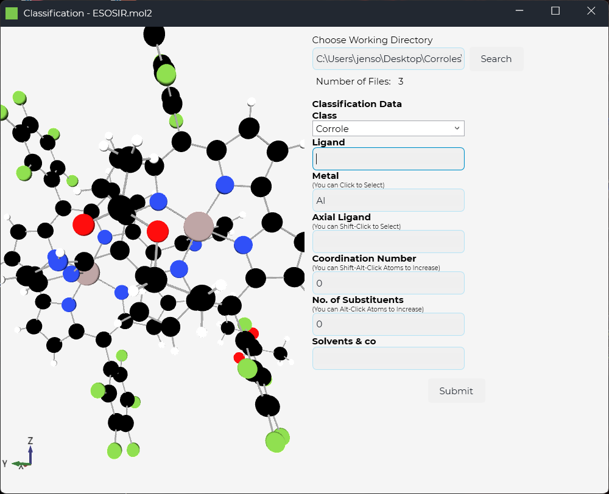

# FileClassification
A quick and dirty project to sort chemical files from one directory into several subdirectories based on type and metal. Also adds meta data for data processing together with [PorphyStruct](https://github.com/jenskrumsieck/porphystruct).


Moves File into subfolder ``$class/$metal`` for example: ``Corrole/Cr`` and adds a ``$filename.meta.json`` File next to it, based on your input. This looks like the following example:

```json
{
  "Ligand": "T(pF-Ph)C",
  "Metal": "Cr",
  "AxialLigand": "NMes",
  "CoordNo": 5,
  "SubstNo": 3,
  "CoSolv": "Toluene",
  "Class": "Corrole",
  "Group": "6",
  "Title": "NAQDAL.mol2"
}
```